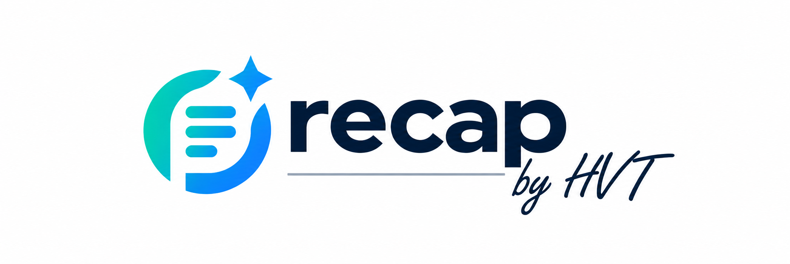

# recap — Autonomous Meeting Intelligence & Hinglish Recorder

<div align="center">
  
  <p><strong>From Meetings to Meaning.</strong></p>
  <p>Autonomous Google Meet recording, verbatim Hinglish transcription, neural speaker diarization, and executive Minutes of Meeting — 100% free cloud and local pipeline.</p>
</div>

---

## Overview

**recap** is a self-hosted meeting intelligence platform designed for founders, engineering leads, and product teams. It joins scheduled Google Meet sessions autonomously, captures high-fidelity 16kHz audio through virtual audio sinks, transcribes dialogues (with native support for conversational Hinglish code-switching), attributes real speaker names, and generates structured executive MOM (decisions, action items, and open questions).

### Key Highlights
- **100% Free-Tier Architecture**: Built on Google Gemini 2.5 Flash, Groq Whisper Large v3, pyannote.audio, and Supabase free tier with ₹0 / $0 monthly infrastructure cost.
- **Native Hinglish Speech-to-Text**: Unlike traditional speech engines that hallucinate or force Hindi into awkward English translations, recap's Gemini 2.5 Flash engine transcribes verbatim Roman-script Hinglish with custom phonetic anchors.
- **4-Key Cloud Failover Cascade**: Seamless automatic failover across dual Gemini and dual Groq keys (with automated MP3 compression if >24MB), backed by local `faster-whisper` as an offline safety net.
- **Silent Autonomous Bot**: Runs headlessly in virtual displays (`DISPLAY=:99`) with PulseAudio null-sink loopbacks. No audio bleed, no echo, and no disruptive bot avatars.
- **Neural Speaker Intelligence**: Combines pyannote 3.1 voice embeddings, Google Meet DOM participant scraping, and LLM contextual analysis to map voice segments to real human names (e.g., `Harsh Vardhan Tripathi`), with 1-click inline editing in the web console.
- **Executive MOM**: Generates concise meeting summaries, structured decisions, and action items with assigned owners (`@name`) and deadlines.
- **7-Day Automated Audio Retention**: Audio is temporarily preserved for 7 days and automatically cleaned up, while structured metadata and transcripts remain permanently in Supabase.

---

## System Architecture

```
                                    +-----------------------------------------+
                                    |        USER'S BROWSER / CLIENT          |
                                    +-----------------------------------------+
                                                         |
                                                         | HTTPS / WSS
                                                         v
                                    +-----------------------------------------+
                                    |          NEXT.JS DASHBOARD              |
                                    |        (Vercel / Local Host)            |
                                    | - / (Landing Page: 5 Core Views)        |
                                    | - /dashboard                            |
                                    | - /meetings & /meetings/[id]            |
                                    | - Realtime Subscriptions                |
                                    +-----------------------------------------+
                                              |                     ^
                       Direct DB queries / RLS|                     | Realtime updates
                                              v                     |
+-----------------------------------------------------------------------------------------------+
|                                      SUPABASE CLOUD                                            |
|  - meetings, jobs, transcripts, speaker_turns, mom, system_events                             |
+-----------------------------------------------------------------------------------------------+
                                      ^                                |
                      Updates State & |                                | Polls upcoming meetings
                      Saves Artifacts |                                | (Atomic claims)
                                      |                                v
+-----------------------------------------------------------------------------------------------+
|                             WORKER / SCHEDULER DAEMON (WSL2 / Linux VM)                       |
|                                                                                               |
|  1. Playwright Headless Chromium (Xvfb DISPLAY=:99)                                           |
|  2. PulseAudio VirtualSink + FFmpeg (16kHz mono WAV)                                          |
|  3. Gemini 2.5 Flash STT (Primary) -> Groq Whisper v3 -> faster-whisper (Fallback)            |
|  4. pyannote.audio 3.1 Diarization                                                            |
|  5. Speaker Resolver (DOM Scrape + Dialogue Context -> Real Human Names)                      |
|  6. Executive MOM Generator (Gemini 2.5 Flash / Groq)                                         |
|  7. Supabase Realtime Sync & 7-Day Storage Cleanup                                            |
+-----------------------------------------------------------------------------------------------+
```

---

## Repository Structure

```
├── config/                  # Meeting allowlist & runtime configuration
├── dashboard/               # Next.js 14 Web Console & Marketing Landing Page
│   ├── public/              # Brand assets & logos
│   ├── src/
│   │   ├── app/             # App Router pages (/ , /dashboard, /meetings, etc.)
│   │   ├── components/      # UI components & AppShell
│   │   └── lib/             # Supabase client & utilities
│   ├── package.json
│   └── next.config.mjs
├── prompts/                 # System prompts for MOM generation & speaker resolution
├── src/                     # Python core backend daemon
│   ├── recorder.py          # Playwright Google Meet joiner & DOM participant scraper
│   ├── stt_worker.py        # Dual-cloud STT cascade (Gemini Flash -> Groq -> Whisper)
│   ├── diarize.py           # pyannote.audio neural speaker diarization
│   ├── merge.py             # Aligns diarization turns with transcript text
│   ├── speaker_resolver.py  # Resolves SPEAKER_XX to real names
│   ├── mom_generator.py     # Generates executive summary, decisions & action items
│   ├── supabase_client.py   # Database sync & state persistence
│   ├── scheduler.py         # Polling loop & atomic job claimer
│   ├── worker.py            # End-to-end pipeline execution runner
│   └── cleanup.py           # 7-day audio cleanup script
├── systemd/                 # systemd service units for 24/7 background execution
├── .env.example             # Template for all environment variables
├── requirements.txt         # Pinned Python dependencies
└── README.md
```

---

## Quick Start

### 1. Backend Setup (Linux / WSL2)

#### Prerequisites
- Ubuntu 22.04 / 24.04 (or WSL2 on Windows)
- Python 3.10+
- FFmpeg & PulseAudio:
  ```bash
  sudo apt-get update && sudo apt-get install -y ffmpeg pulseaudio xvfb
  ```

#### Installation
```bash
git clone https://github.com/itripathiharsh/recap.git
cd recap

# Create virtual environment
python3 -m venv .venv
source .venv/bin/activate

# Install dependencies
pip install -r requirements.txt
playwright install chromium
```

#### Configuration
Copy `.env.example` to `.env` and fill in your credentials:
```bash
cp .env.example .env
```
Key variables:
- `SUPABASE_URL` and `SUPABASE_KEY`: Supabase database credentials
- `GEMINI_API_KEY` & `GEMINI_API_KEY_2`: Primary Hinglish STT & MOM generation
- `GROQ_API_KEY` & `GROQ_API_KEY_2`: Secondary Whisper Large v3 fallback
- `HF_TOKEN`: HuggingFace token with access to `pyannote/speaker-diarization-3.1`
- `DEFAULT_USER_NAME`: Your display name (e.g. `"Harsh Vardhan Tripathi"`)

#### Start the Scheduler Daemon
```bash
# Start virtual audio & display
pulseaudio --start
export DISPLAY=:99
Xvfb :99 -screen 0 1280x720x24 &

# Launch scheduler
python -m src.scheduler
```

---

### 2. Frontend Setup (Next.js Dashboard)

```bash
cd dashboard
npm install
npm run dev
```

Open [http://localhost:3000](http://localhost:3000) in your browser:
- `/` — Modern light-theme SaaS landing page with 5 views (*Features*, *How It Works*, *Pricing*, *Security*, *FAQ*).
- `/dashboard` — Meeting overview, live worker telemetry, and instant scheduling.
- `/meetings/[id]` — Detailed meeting view with verbatim Hinglish transcript, speaker renaming, and executive MOM.

---

## License

Distributed under the MIT License. See `LICENSE` for more information.
