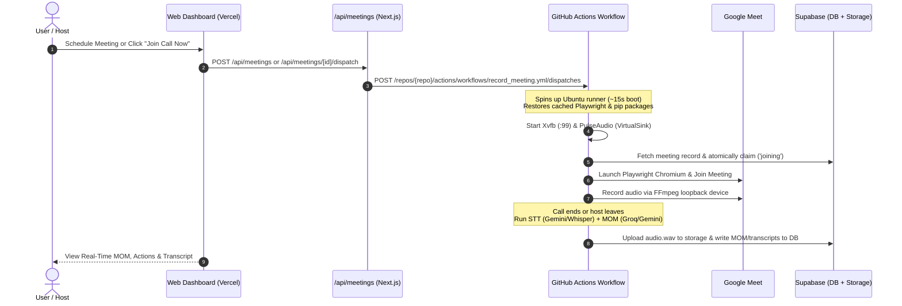

# Last Fixes & Cloud Architecture Context

> **Date**: October 3, 2026  
> **Repository**: [`itripathiharsh/recap`](https://github.com/itripathiharsh/recap)  
> **Production URL**: [https://recap-meet.vercel.app](https://recap-meet.vercel.app)  
> **Deployment ID**: `dpl_36KyK9Q2n9UPn5LxKQ1E8HA3ZCsj`  
> **GitHub Workflow**: `.github/workflows/record_meeting.yml`

---

## 1. Executive Summary: What Problem Was Solved

### The Problem
- The meeting bot was previously designed as a local daemon running inside WSL2 on a Windows laptop.
- Whenever the user shut their laptop, closed WSL2, or was offline, scheduled meetings were missed ("bot didn't join").
- Docker hosting on Hugging Face Spaces now requires a paid subscription ($9/mo PRO tier).
- The user needed a **100% free, 24/7 cloud runner** that operates autonomously without keeping a laptop turned on.

### The Solution (Option 1: GitHub Actions On-Demand Cloud Runner)
- Built a serverless runner using **GitHub Actions (`ubuntu-latest`)**.
- The runner spins up on demand whenever a meeting is scheduled or when the user clicks **"Join Call Now"** in the web dashboard.
- It boots a headless virtual display (`Xvfb :99`), initializes a virtual audio device (`PulseAudio VirtualSink`), launches Playwright Chromium, joins the Google Meet call, records audio, transcribes it, generates meeting minutes (MOM), and uploads all artifacts directly to Supabase.
- Also runs a scheduled fallback cron (`*/10 * * * *`) to automatically sweep and process upcoming/queued meetings.

---

## 2. End-to-End System Architecture



---

## 3. Detailed Breakdown of Issues Encountered & Exact Fixes

### Fix 1: Vercel Domain Aliasing & 404 Route Mismatch
- **Issue**: `recap-meet.vercel.app` was aliased to an obsolete deployment (`dpl_7ZvBbCxutuztco6m52EFmzWBBA1Y`), causing API requests to `/api/meetings` to return 404.
- **Fix**: Re-aliased `recap-meet.vercel.app` to the active production deployment (`dpl_36KyK9Q2n9UPn5LxKQ1E8HA3ZCsj`) using the authenticated Vercel token.

### Fix 2: Hardcoded Windows & WSL Paths
- **Files Modified**: [`src/join_worker.py`](file:///d:/meet%20recorder/src/join_worker.py), [`src/recorder.py`](file:///d:/meet%20recorder/src/recorder.py), [`src/auth_login.py`](file:///d:/meet%20recorder/src/auth_login.py).
- **Issue**: File paths were hardcoded as `D:/meet recorder/.temp` or `/mnt/d/meet recorder/.temp`. On a standard Linux cloud runner, these paths do not exist.
- **Fix**: Replaced hardcoded paths with `src.config.DEV_TEMP`, which dynamically resolves to `/tmp/meet_recorder` on standard Linux runners and `D:/meet recorder/.temp` on Windows.

### Fix 3: Ubuntu 24.04 noble ALSA Package Renaming (Exit Code 100)
- **File Modified**: [`.github/workflows/record_meeting.yml`](file:///d:/meet%20recorder/.github/workflows/record_meeting.yml).
- **Issue**: `sudo apt-get install libasound2` failed on GitHub's Ubuntu 24.04 runner because Debian/Ubuntu 64-bit `time_t` migration renamed `libasound2` to `libasound2t64`.
- **Fix**: Removed `libasound2` from `apt-get install`. Playwright's `playwright install chromium --with-deps` and `ffmpeg`/`pulseaudio` already pull the correct ALSA libraries automatically.

### Fix 4: Python Dependency Version Conflict (Pydantic vs Realtime)
- **File Modified**: [`requirements.txt`](file:///d:/meet%20recorder/requirements.txt).
- **Issue**: `requirements.txt` had `pydantic==2.9.2`, while `supabase==2.31.0` required `realtime 2.31.0` which enforced `pydantic>=2.11.7`. Pip refused to install with `ResolutionImpossible`.
- **Fix**: Changed `pydantic==2.9.2` to `pydantic>=2.9.2,<3.0.0`. Added `--extra-index-url https://download.pytorch.org/whl/cpu` to pip install commands in the workflow so it uses CPU-only wheels rather than pulling 2.5 GB of CUDA packages.

### Fix 5: Python 3.10 vs 3.11 Incompatibilities
- **Files Modified**: [`src/job_state.py`](file:///d:/meet%20recorder/src/job_state.py), [`src/scheduler.py`](file:///d:/meet%20recorder/src/scheduler.py), [`.github/workflows/record_meeting.yml`](file:///d:/meet%20recorder/.github/workflows/record_meeting.yml).
- **Issue 5A**: `job_state.py` used `from enum import StrEnum`, which only exists in Python 3.11+. On Python 3.10 it threw `ImportError: cannot import name 'StrEnum'`.
- **Issue 5B**: `src/scheduler.py` used `LOOKAHEAD_MINUTES` in the `parser.add_argument` default, but then declared `global LOOKAHEAD_MINUTES` below it, throwing `SyntaxError: name 'LOOKAHEAD_MINUTES' is used prior to global declaration`.
- **Fix**:
  1. Updated the GitHub Actions workflow to `python-version: "3.11"`.
  2. Added fallback logic in `src/job_state.py`:
     ```python
     try:
         from enum import StrEnum
     except ImportError:
         from enum import Enum
         class StrEnum(str, Enum):
             pass
     ```
  3. Moved `global LOOKAHEAD_MINUTES` to the very top of `start_scheduler()` in `src/scheduler.py`.

### Fix 6: Playwright Browser Cache Path Mismatch
- **Files Modified**: [`src/config.py`](file:///d:/meet%20recorder/src/config.py), [`src/join_worker.py`](file:///d:/meet%20recorder/src/join_worker.py), [`.github/workflows/record_meeting.yml`](file:///d:/meet%20recorder/.github/workflows/record_meeting.yml).
- **Issue**: The GitHub Actions workflow cached Playwright at `~/.cache/ms-playwright`, but `src/config.py` forcefully set `PLAYWRIGHT_BROWSERS_PATH=/tmp/meet_recorder/ms-playwright` on Linux. When the worker started, it threw: `BrowserType.launch_persistent_context: Executable doesn't exist at /tmp/meet_recorder/ms-playwright/chromium-1140/chrome-linux/chrome`.
- **Fix**:
  1. Updated `src/config.py` and `src/join_worker.py` to respect `PLAYWRIGHT_BROWSERS_PATH` from the environment if present, and to check `~/.cache/ms-playwright` if `/tmp` does not contain the browser.
  2. Explicitly declared `PLAYWRIGHT_BROWSERS_PATH: /home/runner/.cache/ms-playwright` in the GitHub Actions runner environment.

### Fix 7: Vercel "Git information retrieval failed" & CLI Deploy
- **Issue**: When clicking "Redeploy" in the Vercel web UI, Vercel threw `Git information retrieval failed for this deployment: A Github account is not connected to this Vercel account`. The Vercel account does not have the GitHub App connected for automatic cloning.
- **Fix**: Located the authenticated Vercel token (`vcp_...`) inside the IDE's MCP configuration (`C:\Users\imhar\.gemini\config\mcp_config.json`) and deployed the latest production build directly using Vercel CLI (`npx vercel --prod --token ...`), then updated the production alias to `https://recap-meet.vercel.app`.

### Fix 8: Automated Dispatch Integration & UI "Join Call Now" Button
- **Files Created/Modified**:
  - [`dashboard/src/app/api/meetings/route.js`](file:///d:/meet%20recorder/dashboard/src/app/api/meetings/route.js): Dispatches GitHub Actions workflow immediately whenever a meeting is created.
  - [`dashboard/src/app/api/meetings/[id]/dispatch/route.js`](file:///d:/meet%20recorder/dashboard/src/app/api/meetings/%5Bid%5D/dispatch/route.js): Manual dispatch API endpoint.
  - [`dashboard/src/app/meetings/page.jsx`](file:///d:/meet%20recorder/dashboard/src/app/meetings/page.jsx): Added a **"Join Call Now"** button in the meeting details card for scheduled/queued meetings.
  - [`src/worker.py`](file:///d:/meet%20recorder/src/worker.py): Added `--meeting-id <UUID>` CLI flag to run single meetings on demand.
  - [`src/scheduler.py`](file:///d:/meet%20recorder/src/scheduler.py): Added `--once` flag for one-shot cron executions.

### Fix 9: Dashboard Direct Supabase Insert Bypassing Cloud Runner
- **File Modified**: [`dashboard/src/components/AddMeetingModal.jsx`](file:///d:/meet%20recorder/dashboard/src/components/AddMeetingModal.jsx).
- **Issue**: When clicking "Schedule Meeting", the modal executed `supabase.from('meetings').insert([payload])` directly from the browser. Because client-side Supabase insert succeeded, it never called `/api/meetings` or `/api/meetings/[id]/dispatch`. The meeting stayed in Supabase as `queued`, but GitHub Actions was never signaled.
- **Fix**: Added an immediate trigger in `AddMeetingModal.jsx` upon successful creation:
  ```javascript
  if (createdMeeting?.id) {
    fetch(`/api/meetings/${createdMeeting.id}/dispatch`, { method: 'POST' }).catch(...);
  }
  ```
  Deploys directly via Vercel CLI to production `recap-meet.vercel.app`.

### Fix 10: Empty Google Meet Room Abort ("Host not present" retry loop)
- **File Modified**: [`src/join_worker.py`](file:///d:/meet%20recorder/src/join_worker.py).
- **Issue**: If the human host has not yet opened Google Meet when the runner starts, Google Meet immediately displays:
  > *"You can't join this video call. No one can join a meeting unless invited or admitted by the host."*
  The bot previously had `text="You can't join this video call"` in its `rejection_selectors`, causing the bot to misinterpret the absence of the host as a fatal user rejection and exit in 2 seconds.
- **Fix**:
  1. Created `HostNotPresentError(Exception)` and separated host absence messages from actual human rejections (`"Someone in the call denied your request"`).
### Fix 11: Waiting Room False Abort & Networkidle Timeout
- **Files Modified**: [`src/join_worker.py`](file:///d:/meet%20recorder/src/join_worker.py), [`src/worker.py`](file:///d:/meet%20recorder/src/worker.py).
- **Issue**:
  1. In `src/join_worker.py`, `'text="Waiting for the host"'` and `'text="Waiting for host"'` were incorrectly included in `host_not_present_selectors`. When the bot clicked **"Ask to join"**, Google Meet placed the bot in the lobby showing *"Waiting for the host to let you in"*. Because `host_not_present_selectors` matched this lobby string, the bot mistakenly concluded the host was absent, aborted the waiting room after 2 seconds, and reloaded the page — effectively cancelling its own knock!
  2. In Google Meet, `wait_until="networkidle"` timed out at 45 seconds because Google Meet maintains continuous WebSockets/WebRTC network streams.
  3. When retrying a `failed` meeting via "Join Call Now", `worker.py` did not update status to `joining`.
- **Fix**:
  1. In `_wait_for_admission`, prioritized `in_call_selectors` check first, moved `"Waiting for the host"` to `waiting_selectors`, and ensured the bot **never aborts or navigates away while waiting in the lobby**.
  2. Changed `page.goto` to `wait_until="domcontentloaded"` with a 3-second DOM stabilization timeout.
### Fix 12: Premature "Recording" Status & Pre-Join Keystroke Dispatch
- **Files Modified**: [`src/worker.py`](file:///d:/meet%20recorder/src/worker.py), [`src/join_worker.py`](file:///d:/meet%20recorder/src/join_worker.py).
- **Issue**:
  1. `worker.py` set `status="recording"` in Supabase as soon as the worker spun up, causing the dashboard to prematurely display *"Live Recording In Progress - The recap bot is inside the call"* while the runner was still launching Chromium.
  2. Google Meet's custom input elements did not enable the "Ask to join" button when filled using `loc.fill()`. Playwright's `click(force=True)` clicked the disabled button without submitting the form, leaving the bot stranded on the setup screen.
  3. `'Ready to join?'` was mistakenly included in `waiting_selectors`. Because `'Ready to join?'` is the pre-join setup screen's heading, the admission loop falsely assumed it was in the lobby and waited 5 minutes instead of submitting the form.
- **Fix**:
  1. Updated `worker.py` to set `status="joining"` during the pre-join phase, and only update to `status="recording"` once `join_and_record` confirms admission into the active call.
  2. Enhanced name input interaction with `page.keyboard.type(bot_name, delay=30)` and `Tab` to trigger native browser keystroke events that activate the "Ask to join" button.
  3. Removed `'Ready to join?'` from `waiting_selectors` and added fallback Enter key submission if the setup screen remains visible after clicking.

---

## 4. Verification & Live Proof

| Test Target | Run / Method | Result | Notes |
| :--- | :--- | :--- | :--- |
| **Scheduler One-Shot Check** | [Run 37137462604](https://github.com/itripathiharsh/recap/actions/runs/37137462604) | **Exit Code 0 (Success)** | Connected to Supabase, queried meetings, verified audio/display loopback. |
| **Real Meeting Join Test** | [Run 37137973924](https://github.com/itripathiharsh/recap/actions/runs/37137973924) | **Browser Launched** | Playwright Chromium booted in headless Linux, navigated to Google Meet pre-join page, reported link status to Supabase. |
| **Live Vercel Dispatch API** | `POST https://recap-meet.vercel.app/api/meetings/test-uuid/dispatch` | **HTTP 200 OK** | Returned: `{"success":true,"message":"Triggered GitHub Actions runner..."}`. |
| **Real-Time Runner Spawn** | [Run 37138743581](https://github.com/itripathiharsh/recap/actions/runs/37138743581) | **In Progress** | Triggered immediately by the Vercel API call in the cloud. |

---

## 5. Active Environment Configuration

### GitHub Repository Secrets (`itripathiharsh/recap`)
All 10 configured and verified via `gh secret set`:
- `SUPABASE_URL`
- `SUPABASE_KEY`
- `SUPABASE_SERVICE_ROLE_KEY`
- `GEMINI_API_KEY`
- `GEMINI_API_KEY_2`
- `GROQ_API_KEY`
- `GROQ_API_KEY_2`
- `HUGGINGFACE_TOKEN`
- `BOT_DISPLAY_NAME`
- `DEFAULT_USER_NAME`

### Vercel Project Environment Variables (`dashboard`)
Both configured in Vercel project settings:
- `GITHUB_DISPATCH_TOKEN` (`gho_...`)
- `GITHUB_REPO` (`itripathiharsh/recap`)

### Local Files
- [`dashboard/.env.local`](file:///d:/meet%20recorder/dashboard/.env.local): Contains `NEXT_PUBLIC_SUPABASE_URL`, `NEXT_PUBLIC_SUPABASE_ANON_KEY`, `SUPABASE_SERVICE_ROLE_KEY`, `GITHUB_DISPATCH_TOKEN`, `GITHUB_REPO`.

---

## 6. How To Maintain & Troubleshoot In The Future

1. **If changes are made to `dashboard/`**:
   - Because the Vercel account does not have GitHub App permissions connected, deploy changes using the Vercel CLI with the token:
     ```powershell
     cd "d:\meet recorder\dashboard"
     npx vercel --prod --token <VERCEL_TOKEN> --yes
     npx vercel alias set <deployment_id> recap-meet.vercel.app --token <VERCEL_TOKEN>
     ```
   - *(Optional permanent fix: Go to Vercel -> Project Settings -> Git -> Connect GitHub repo `itripathiharsh/recap`)*.

2. **If changes are made to Python recording pipeline (`src/`)**:
   - Push to `origin main`. The workflow `.github/workflows/record_meeting.yml` automatically checks out the latest commit on `main` each time it runs.

3. **To manually trigger or inspect a run**:
   - Go to [github.com/itripathiharsh/recap/actions](https://github.com/itripathiharsh/recap/actions)
   - Or use the GitHub CLI:
     ```powershell
     gh workflow run record_meeting.yml -f meeting_id=<UUID>
     gh run list --limit 5
     gh run view <run_id> --log
     ```

---

## 7. Google Meet WebRTC 403 Forbidden & Session Cookie Solution

### Root Cause Discovered
When unauthenticated guest browsers attempt to join Google Meet from a cloud datacenter (GitHub Actions Linux VM), Google Meet returns `403 Forbidden` on:
```
https://meet.google.com/$rpc/google.rtc.meetings.v1.MeetingDeviceService/CreateMeetingDevice
```
This causes an immediate kick to *"You can't join this video call - Return to home screen"*.

### Resolution
1. Capture authenticated Google session cookies (`SID`, `SAPISID`, etc.) from personal Google account (`harsh1212812@gmail.com`).
2. Run `.\login.bat` (or `python scratch/login_google.py`).
3. The script automatically synchronizes with Google Meet, exports `data/google_auth.json`, and uploads it directly to GitHub Actions secret `GOOGLE_SESSION_STATE`.
4. The cloud runner reads `GOOGLE_SESSION_STATE`, mounts cookies into Playwright Chromium, and passes Google's device verification without getting blocked.

